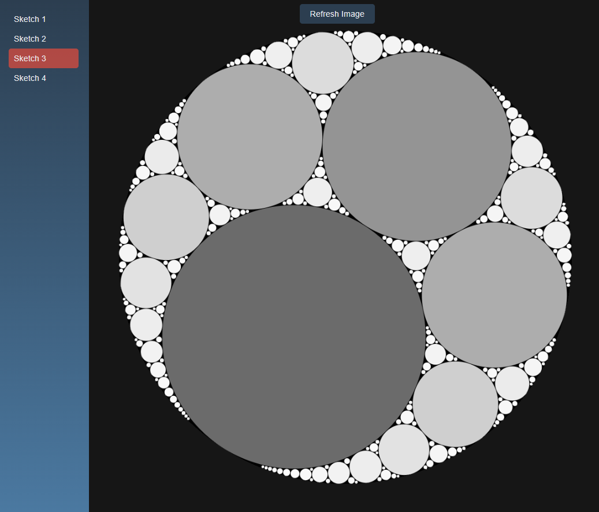

# Fractal Gasket JS

This project is about creating different forms of Apollonian Gasket using the Descartes Circle Theorem and complex numbers in JavaScript. The Apollonian Gasket is a fractal generated from three circles mutually tangent to each other. The Descartes Circle Theorem is used to calculate the curvature of the next circles in the fractal.

The project will be divided into different drawing folders, each having its own unique implementation of the Apollonian Gasket. Drawing2 will have extra feature such as cursor tracker and interaction with the gasket.



## File Structure
```
complex.js
drawing1/
    circle1.js
    index.html
    sketch1.js
drawing2/
    circle2.js
    index.html
    sketch2.js
index.html
README.md
style.css
```

## Files

- `circle1.js` and `circle2.js`: These files define a Circle class. Each `circle` is defined by its bend (curvature), center point, and depth. The center point is stored as a `Complex` number. The radius of the circle is derived from the absolute value of the reciprocal of the bend. The depth is also the generation number, and it's used to select a color for the circle.
- `complex.js`: This file likely contains the implementation of the `Complex` class, which is used to represent complex numbers. Complex numbers are used in the calculations for generating new circles based on Descartes' theorem.
- `sketch1.js` and `sketch2.js`: These files contain the main logic for generating the Apollonian Gasket. They maintain a list of all circles in the gasket and a queue of circles to process for the next generation. They also contain functions for validating potential new circles, checking if two circles are tangent, and generating the next generation of circles. The `complexDescartes` function is used to calculate the curvatures and centers for new circles using Descartes' theorem.

## How It Works

The project uses Descartes' theorem to generate new circles in the gasket. Each circle is defined by its bend (curvature), center point, and depth. The center point is stored as a complex number, and the radius is derived from the absolute value of the reciprocal of the bend. The depth is also the generation number, and it's used to select a color for the circle.

The `complexDescartes` function in `sketch1.js` and `sketch2.js` calculates the curvatures and centers for new circles using Descartes' theorem. The resulting circles are added to the gasket and queued for processing in the next generation.


## Getting Started

To get started with this project:

1. Clone the repository to your local machine.
2. Open the `index.html` file in a web browser to view the visualization.
3. Explore the code to understand how the fractal is generated.

## References
This project is inspired by the paper ["The Apollonian Packing of Circles"](https://arxiv.org/pdf/math/0101066.pdf). This paper provides a detailed mathematical explanation of the Apollonian Gasket and the Descartes Circle Theorem.